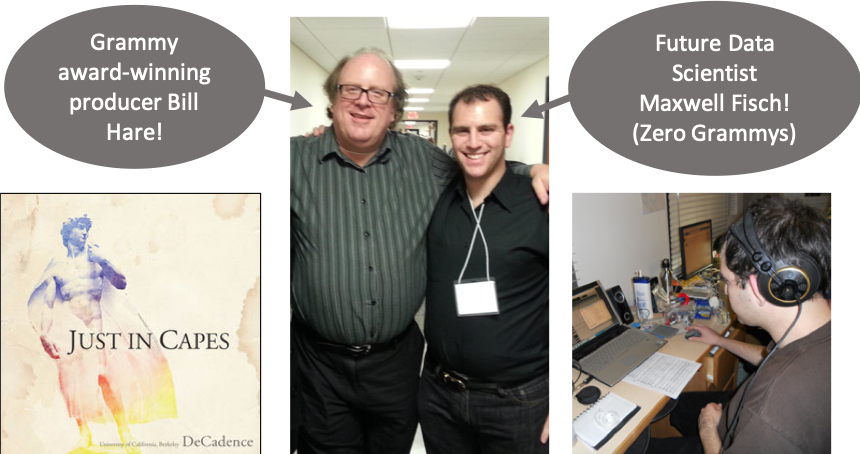
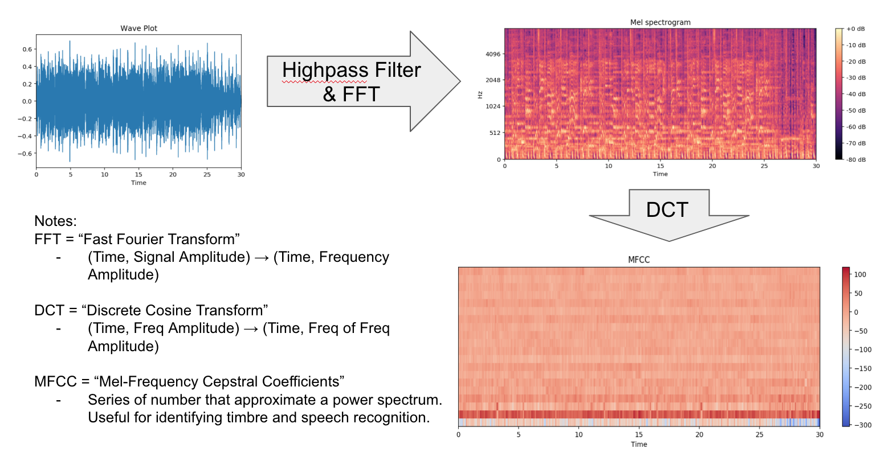
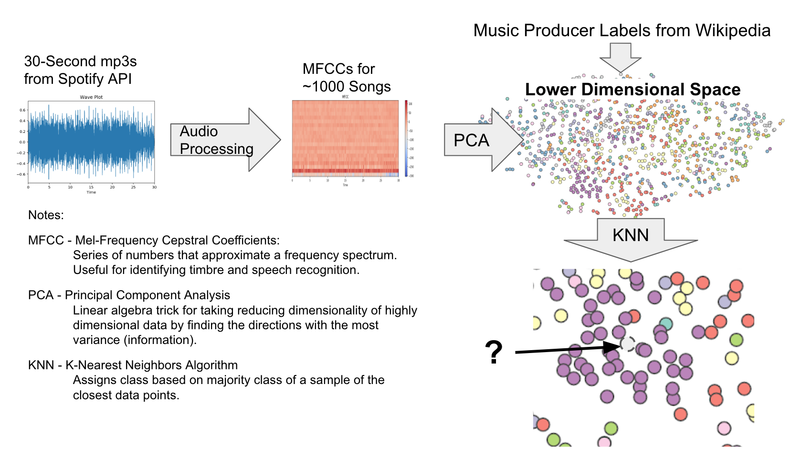
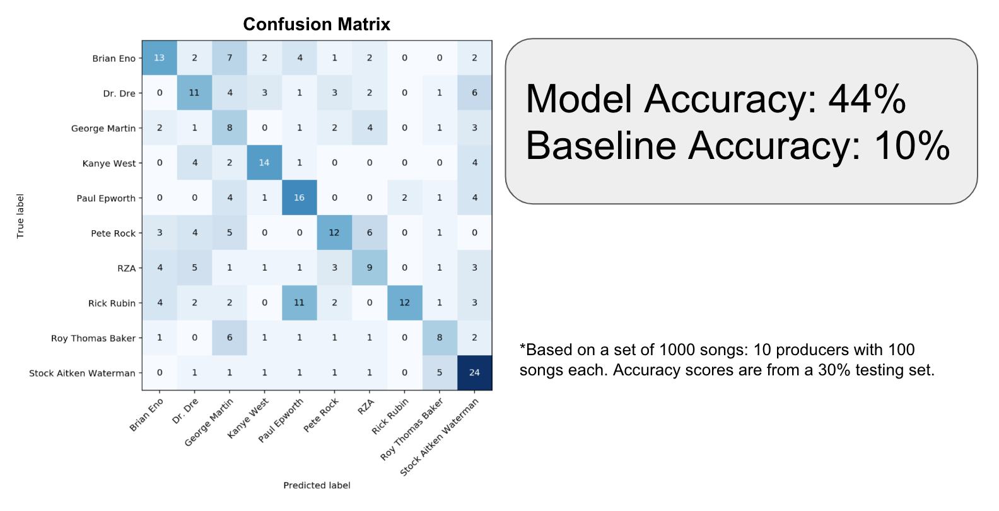
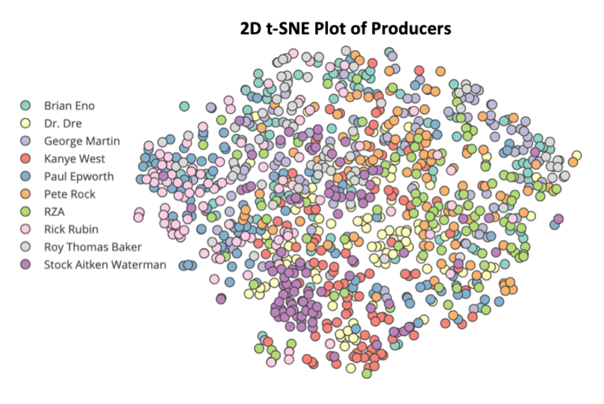

# Production Value
**Identifying Record Producers from Audio Data**
 Maxwell Fisch
 
[Linkedin](http://www.linkedin.com/in/maxwellhfisch) | [Twitter](https://twitter.com/Maxwell_Fisch) | [Github](https://github.com/mhfisch)

## Table of Contents

* [Motivation](#motivation)
  * [Personal](#personal)
  * [Business](#business)
* [Data Understanding](#data-understanding)
  * [Data Sources](#data-sources)
  * [Audio Processing](#audio-processing)
  * [Modeling](#modeling)
  * [Evaluation](#evaluation)
* [Future Improvements](#future-improvements)
* [Built With](#built-with)
* [Acknowledgements](#acknowledgements)
* [Contact Me](#contact-me)

## Motivation

### Personal

In my senior year of college I lead my a cappella group in the creation of our album [Just in Capes](https://itunes.apple.com/us/album/just-in-capes/587956878). I networked with Grammy Award-winning producer [Bill Hare](http://billhareacappella.com/home.html) and saw firsthand the extent to which a music producer can have influence over the sound of an album.

### Business

This model can be used for two main purposes:
* **Music Discovery**: Services like Pandora and Spotify leverage their ability to find music users will like. Production "sound" is another dimension that users may enjoy exploring when searching for new music.
* **Music Publishing**: The creation and maintenance of a database of music production and ownership credits has been an [historically difficult task](https://en.wikipedia.org/wiki/Music_ownership_databases). When streaming services pay royalties to record labels often creative collaborators do not get paid properly because of missing documentation. Production Value is a step toward "fingerprinting" the creators of a song.

## Data Understanding

### Data Sources

* [Spotify API](https://developer.spotify.com/documentation/web-api/) - Contains audio files and song metadata.
* [Wikipedia](https://www.wikipedia.org/) - Record producer labeling.

### Audio Processing

Identifying a record producer lies in the [timbre](https://en.wikipedia.org/wiki/Timbre) of a sound. Timbre can be thought of as the "quality" or "identity" of a sound. It's what allows us to tell a flute from a trumpet even if they are playing the same notes. Timbre can be found in the higher-frequency [overtones](https://en.wikipedia.org/wiki/Overtone) of a sound.

Audio mp3 clips 30-seconds long from 1000 songs (10 producers, 100 songs each) were converted to .WAV files and run through a highpass filter to accentuate the timbre frequencies. For each clip, the [Mel-Frequency Cepstral Coefficients](https://en.wikipedia.org/wiki/Mel-frequency_cepstrum) (MFCCs) were calculated.

MFCCs, very generally, are a set of values that correspond to the timbre of a sound.

More technically, MFCCs are calculated by first taking the [Fast Fourier Transform](https://en.wikipedia.org/wiki/Fast_Fourier_transform) (FFT) of a waveform to convert from amplitude-time space to frequency-time space. Then, each frequency power spectrum of the FFT is treated as its own wavelet and is decomposed further using the [Discrete Cosine Transform](https://en.wikipedia.org/wiki/Discrete_cosine_transform) (DCT). The resulting values are the Mel-Frequency Cepstral Coefficients. The figure below shows an example of the audio processing.

### Modeling

After processing, each song has about 24,000 MFCCs (20 in the frequency dimension, 1200 in the time dimension). [Principal Component Analysis](https://en.wikipedia.org/wiki/Principal_component_analysis) (PCA) was used to reduce the dimensionality to 12 sonic eigenvectors.

A [K-Nearest Neighbors](https://en.wikipedia.org/wiki/K-nearest_neighbors_algorithm) (KNN) algorithm was used to identify the most likely producers for any new song. The figure below shows how an example of how the KNN algorithm works.

### Evaluation

The model was tested on a 300-song testing set. The multiclass accuracy for 10 balanced classes of producers was 44% compared to a baseline of 10%.

The data were then plotted on a 2D [t-SNE](https://en.wikipedia.org/wiki/T-distributed_stochastic_neighbor_embedding) plot to show the relative clustering of songs.

An interactive t-SNE plot can be found [here](https://plot.ly/~maxwellfisch/22/t-sne-plot-of-tracks/#/).

## Future Improvements
* Deconvolution of Variables:
  * Artist/Album/Instrumentation
  * More accurate labeling
* Scale:
  * More songs/producers
  * Parallelize and deploy on AWS/Spark
* Feature Engineering:
  * More Audio Processing/Reverse Engineering
  * Remove music structure by breaking songs into beats
* Modeling:
  * Neural Networks with Tensorflow/Keras

## Built With

* [Python](https://www.python.org/)
* [MongoDB](https://www.mongodb.com/)
* [Pandas](https://pandas.pydata.org/)
* [Numpy](http://www.numpy.org/)
* [LibROSA](https://librosa.github.io/librosa/)
* [SpotiPy](https://spotipy.readthedocs.io/en/latest/)
* [SciPy](https://www.scipy.org/)
* [SKLearn](https://scikit-learn.org/stable/)
* [Plotly](https://plot.ly/#/)

## Acknowledgements

* [Galvanize](https://www.galvanize.com/) and the Data Science Immersive Team, for their guidance and support.
  * Moses Marsh
  * Brandon Martin-Anderson
  * Elliott Saslow
  * Hamid Molavian
* Bill Hare, for being the inspiration for this project.
* Lily Lin, for always believing in me.

## Contact Me

Maxwell Fisch is a Data Scientist with an extensive background as a Root Cause Failure Analyst with a history of highly analytical work in materials science and consumer electronics. His interests outside of Data Science include theater, music, cooking, and board games. You can contact him at:

* Linkedin: [in/maxwellhfisch](http://www.linkedin.com/in/maxwellhfisch)
* Twitter: [@Maxwell_Fisch](https://twitter.com/Maxwell_Fisch)
* Github: [@mhfisch](https://github.com/mhfisch)

<!-- # Important data

## What do the fields mean?

Find the field descriptions at [https://labrosa.ee.columbia.edu/millionsong/pages/field-list]

From www.discogs.com:

  In the music industry, a record producer has many roles, among them controlling the recording sessions, coaching and guiding the musicians, organizing and scheduling production budget and resources, and supervising the recording, mixing and mastering processes. This has been a major function of producers since the inception of sound recording, but in the latter half of the 20th century producers have also taken on a wider entrepreneurial role.

Maybe I should use NME.com's 50 of the Greatest Producers Ever [https://www.nme.com/list/50-of-the-greatest-producers-ever-1353]

Also check out [https://en.wikipedia.org/wiki/Record_producer#Influential_record_producers]

And [https://en.wikipedia.org/wiki/Category:Record_producers]

Audio Analysis Description [https://developer.spotify.com/documentation/web-api/reference/tracks/get-audio-analysis/]

Audio Features [https://developer.spotify.com/documentation/web-api/reference/tracks/get-audio-features/]

Note: Audio Valence in Audio Features is "A measure from 0.0 to 1.0 describing the musical positiveness conveyed by a track. Tracks with high valence sound more positive (e.g. happy, cheerful, euphoric), while tracks with low valence sound more negative (e.g. sad, depressed, angry)."

Also, check out LibROSA [https://librosa.github.io/librosa/index.html] - Open source python audio analyzer.

### What is a Record Producer?

From www.discogs.com:

  >In the music industry, a record producer has many roles, among them controlling the recording sessions, coaching and guiding the musicians, organizing and scheduling production budget and resources, and supervising the recording, mixing and mastering processes. This has been a major function of producers since the inception of sound recording, but in the latter half of the 20th century producers have also taken on a wider entrepreneurial role.

### Why do this project?
[Insert my personal story here]

# Problem Statement

**Music Discovery:**
  >Reasons, reasons, reasons.

**Music Attribution in Publishing:**
  >More, more reasons.

 -->
